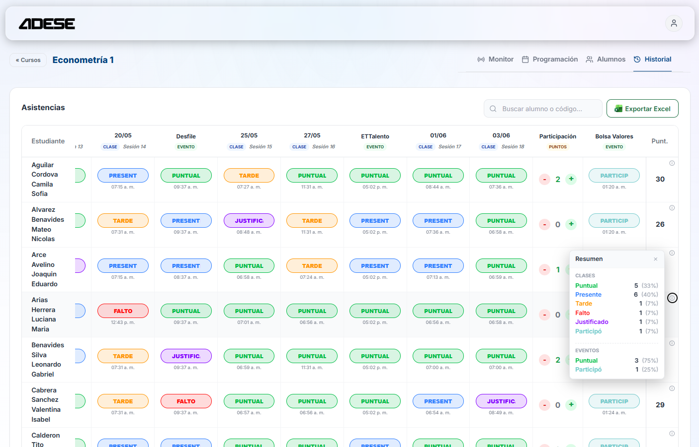
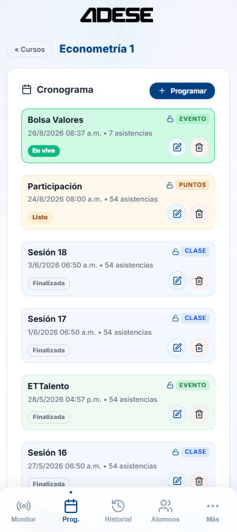
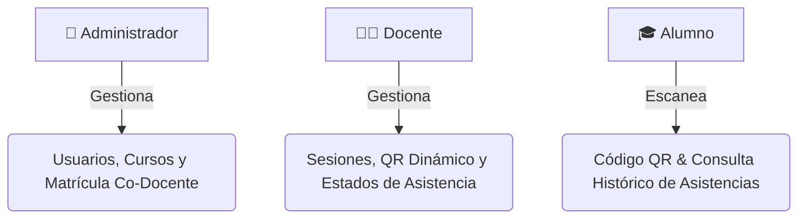

<div align="center">

  

  # 🎓 ADESE `v5.0.0`
  ### **Asistencia Digital Estratégica para el Sector Educativo**

  Una plataforma web integral, interactiva y multi-rol diseñada para **registrar, controlar y gestionar en tiempo real la asistencia y el rendimiento estudiantil** mediante códigos QR dinámicos y analíticas avanzadas.

  [](https://react.dev/)
  [](https://vitejs.dev/)
  [](https://nodejs.org/)
  [](https://expressjs.com/)
  [](https://www.postgresql.org/)
  [](https://www.docker.com/)
  [](LICENSE)

  <br />

  

</div>

---

## 📖 Índice

- [✨ Descripción General](#-descripción-general)
- [📱 Vista Previa (Web & Mobile)](#-vista-previa-web--mobile)
- [🚀 Características Principales](#-características-principales)
- [👤 Roles y Capacidades](#-roles-y-capacidades)
- [🛠️ Stack Tecnológico](#️-stack-tecnológico)
- [📁 Estructura del Proyecto](#-estructura-del-proyecto)
- [🗄️ Arquitectura de Base de Datos](#️-arquitectura-de-base-de-datos)
- [⚙️ Guía de Instalación y Despliegue](#️-guía-de-instalación-y-despliegue)
- [🤝 Licencia](#-licencia)

---

## ✨ Descripción General

**ADESE** revoluciona la toma de asistencia en el aula sustituyendo los métodos manuales tradicionales por un flujo **100% digital, automatizado y seguro**. 

Con un enfoque **Mobile-First**, la plataforma genera códigos QR dinámicos en la pantalla del profesor que expiran continuamente (tecnología basada en JWT tokenizados). Los alumnos escanean el código directamente desde sus dispositivos móviles, registrando su presencia con fecha, hora exacta y cálculo automático de tardanza o falta segun la tolerancia configurada.

---

## 📱 Vista Previa (Web & Mobile)

<div align="center">
  <table>
    <tr>
      <td align="center" width="50%">
        <b>💻 Panel Web (Laptop / Desktop)</b><br/><br/>
        
      </td>
      <td align="center" width="25%">
        <b>📱 Escaneo Alumno (Mobile)</b><br/><br/>
        
      </td>
      <td align="center" width="25%">
        <b>📲 QR Dinámico</b><br/><br/>
        
      </td>
    </tr>
  </table>
</div>

---

## 🚀 Características Principales

| Característica | Descripción |
| :--- | :--- |
| **🛡️ QR Dinámico Anti-Fraude** | Códigos QR dinámicos basados en JWT que cambian automáticamente cada pocos segundos para evitar capturas de pantalla compartidas entre alumnos. |
| **⏱️ Horarios y Tolerancia Flexible** | Los docentes pueden personalizar el margen de tolerancia por clase. El sistema determina automáticamente si la asistencia es *Puntual*, *Tarde* o *Falta*. |
| **📊 Estados con Ponderación Numérica** | Creación de estados personalizados (ej. *Puntual = 20 pts*, *Tarde = 15 pts*, *Falto = 0 pts*) con colores representativos y puntaje acumulativo. |
| **💎 UI Glassmorphism Premium** | Interfaz moderna con temas oscuros, animaciones fluidas, componentes translúcidos de cristal (*Glassmorphism*) y diseño responsivo. |
| **⚡ Monitoreo en Tiempo Real** | Visualización en vivo de los estudiantes que ingresan a la sesión, estado automático asignado y opción de edición manual/justificaciones. |
| **📁 Exportación e Importación** | Soporte de carga masiva de alumnos/cursos desde archivos Excel/CSV y exportación de reportes de asistencia. |

---

## 👤 Roles y Capacidades



- **👑 Administrador (Admin):**
  - Panel de control global (Dashboard de metricas).
  - Creación y gestión de usuarios (Alumnos, Docentes, Admins).
  - Creación de cursos y matriculación simultánea.
  - Soporte de **co-docencia** (asignación de múltiples profesores por asignatura).
- **👨‍🏫 Docente (Profesor):**
  - Gestión de sesiones de clase (Creación, Apertura, Cierre).
  - Pantalla proyectable de QR dinámico interactivo.
  - Personalización de regla de tolerancia y estados de asistencia con puntaje.
  - Edición manual de asistencias y aprobación de justificaciones.
- **🎓 Alumno (Estudiante):**
  - Interfaz móvil optimizada para escaneo rápido con cámara integrada.
  - Panel personal con resumen de asistencias, puntualidad y faltas por curso.

---

## 🛠️ Stack Tecnológico

### **Frontend**
- **Framework:** React 18 + Vite
- **Estilos:** Vanilla CSS modular con variables personalizadas y efectos Glassmorphism
- **Iconos & UI:** `lucide-react`, `react-hot-toast`
- **Utilidades:** `html5-qrcode` / `qrcode.react` para escaneo y proyección QR

### **Backend & API**
- **Runtime:** Node.js (API RESTful con Express)
- **Seguridad / Autenticación:** JSON Web Tokens (JWT) y derivación hash de contraseñas (`bcryptjs`)
- **Base de Datos:** PostgreSQL con driver `pg`

### **Infraestructura & Contenedores**
- **Docker & Docker Compose:** Aislamiento del Frontend, Backend API y Postgres.
- **pgAdmin (Opcional):** Administración gráfica de base de datos incluida en la red interna de Docker.

---

## 📁 Estructura del Proyecto

```text
adese/
├── 📂 .agents/             # Habilidades y reglas del asistente
├── 📂 api/                 # Configuración adicional de servicios API
├── 📂 backend/             # Servidor API RESTful Node.js + Express
│   ├── 📄 index.js         # Endpoints de la API y lógica de negocio
│   ├── 📄 init.sql         # Script SQL inicial (Tablas, Triggers, Vistas)
│   ├── 🐳 Dockerfile       # Imagen Docker del servicio Backend
│   └── 📄 package.json     # Dependencias Backend
├── 📂 public/              # Recursos estáticos (Logos, imágenes de documentación)
│   ├── 🖼️ adese_icon.svg    # Icono principal de la aplicación
│   ├── 🖼️ home.png          # Vista previa Laptop / Panel Web
│   ├── 🖼️ phone.png         # Vista previa Mobile / Escaneo Alumno
│   └── 🖼️ qrd.jpg           # Vista previa QR Dinámico de sesión
├── 📂 src/                 # Aplicación Cliente (React UI)
│   ├── 📂 api/             # Cliente HTTP / Axios para comunicación Backend
│   ├── 📂 components/      # Componentes de UI reutilizables (Modales, Tablas, QR)
│   ├── 📂 pages/           # Vistas principales (AdminPage, TeacherPage, StudentPage)
│   ├── 📂 styles/          # Hojas de estilo estructuradas
│   ├── 📄 App.jsx          # Enrutador principal y gestión del estado global
│   └── 📄 main.jsx         # Punto de entrada de Vite/React
├── 🐳 docker-compose.yml   # Orquestación multicontenedor (Frontend, API, Postgres)
├── 🐳 Dockerfile           # Imagen Docker del servicio Frontend
├── 📄 package.json         # Dependencias del Frontend
├── 📄 vite.config.js       # Configuración de compilación Vite
└── 📄 README.md            # Documentación del proyecto
```

---

## 🗄️ Arquitectura de Base de Datos

El modelo relacional centraliza la información en las siguientes entidades unificadas:

```
[roles] <--- (1:N) ---> [usuarios] <--- (N:M curso_usuarios) ---> [cursos]
                             |                                      |
                             | (1:N)                                | (1:N)
                             v                                      v
                    [estados_asistencia]                    [sesiones]
                             \                                     /
                              \---> (1:N) -> [asistencias] <- (1:N)-/
```

- **`roles`**: Define niveles de acceso (`admin`, `docente`, `alumno`).
- **`usuarios`**: Entidad central con credenciales y datos de perfil.
- **`cursos`**: Asignaturas o materias impartidas.
- **`curso_usuarios`**: Tabla intermedia de matriculación y asignación de profesores (admite co-docencia).
- **`estados_asistencia`**: Tipos de marca parametrizables (*Puntual*, *Tarde*, *Falto*, *Justificado*) con su peso en puntos.
- **`sesiones`**: Clases individuales abiertas por los docentes con parámetros de tolerancia y fechas.
- **`asistencias`**: Registros transaccionales de marcajes con marcas de tiempo y estado automático calculado.

---

## ⚙️ Guía de Instalación y Despliegue

### 🐳 Opción A: Despliegue Rápido con Docker Compose (Recomendado)

Requisitos previos: tener instalado **Docker** y **Docker Compose**.

1. **Clonar el repositorio:**
   ```bash
   git clone https://github.com/tu-usuario/adese.git
   cd adese
   ```

2. **Iniciar todos los servicios:**
   ```bash
   docker-compose up -d --build
   ```

3. **Acceder a la aplicación:**
   - 🌐 **Frontend App:** `http://localhost:5173`
   - ⚡ **Backend API:** `http://localhost:3000`
   - 🐘 **PostgreSQL DB:** `localhost:5432`

---

### 💻 Opción B: Ejecución Local para Desarrollo

#### 1. Backend (API)
```bash
cd backend
npm install
npm run dev
```

#### 2. Frontend (React)
En una nueva terminal en la raíz del proyecto:
```bash
npm install
npm run dev
```
Accede a `http://localhost:5173`.

---

## 🤝 Licencia

Este proyecto está distribuido bajo la licencia **MIT**. Para más detalles, consulta el archivo [LICENSE](LICENSE).

---

<div align="center">
  <sub>Desarrollado con ❤️ para transformar la gestión educativa.</sub>
</div>
